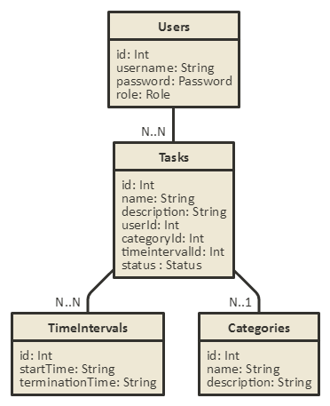

# FamilyToDo
Family ToDo list application

## Feladat
Egy családi teendőkek tároló alkalmazás létrehozása az alábbi követelményekkel: többfelhasználós rendszer, amely jogkör szerinti megkülönböztetéssel kezeli a teendőkkel végezhető operációkat. A teendőket csak admin jogkörrel rendelkező felhasználó hozhassa létre. A többi művelethez(feladat megtekintése, megjelölés elvégzettként, stb.) nem szükséges admin hozzáférés. Egy feladat, teendőt jellemezzünk többféle tulajdonsággal, mint például témakör, mely felhasználókhoz tartozik a feladat elvégzése stb.

## Funkcionális követelmények
* Felhasználóként lehessen teendőt törölni(teendő törlése - megjelölés elvégzettként)
* Adminisztrátorként(a felhasználói jogkörön túl) lehessen teendőt létrehozni(teendő létrehozása - név, leírás)
* Adminisztrátorként lehessen teendőt módosítani(teendő módosítása)
* Legyen egy belépő oldal, ahol a felhasználók bejelentkezhetnek
* A bejelentkezés után jelenjen meg egy lista, amely a teendők listáját tartalmazza időrendi sorrendben
* Felhasználóként lehessen kijelentkezni

## Nemfunkcionális követelmények
* Ergonomikus, letisztult elrendezés és kinézet
* Gyors működés
* Biztonságos működés: jelszavak tárolása, funkciókhoz való hozzáférés

## Szerepkörök
* Felhasználó: bejelentkezés után a teendők listájához fér hozzá, egy teendőt csak elvégzettnek tud megjelölni
* Adminisztrátor: a felhasználói szerepkörökön túl létre is tud hozni teendőket
* Továbbá módosítani is tudja azokat

## Adatmodell

## Végpontok
* user/login
* user/resiter
* user/logout
* tasks